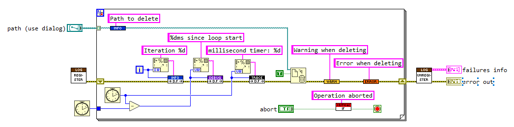
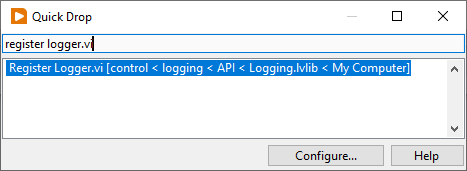

# GLog
Simple, Configurable, and Extensible logger library for LabVIEW.

This project is a logging framework designed to make application logging in LabVIEW easy. The library ships with features that cover most basic logging needs with minimal configuration, and provides an extensible API that makes creating advanced logging solutions much simpler. It was created with the following design goals in mind:
- Separate handling and invocation, enabling library developers to add logging calls to their code while deferring *how* those calls are handled to the application developer.
- Have a minimal-impact API which integrates seamlessly into existing code.
- Provide great defaults that make using the library and learning new features easy and natural.
- Include built-in features that support many common use cases.
- Allow users to extend functionality and customize behavior to suit any use case.
- Provide robust error handling and traceability when errors do occur.

The project was inspired by Python's [logging module](https://docs.python.org/3/library/logging.html). This [mCoding video](https://www.youtube.com/watch?v=9L77QExPmI0) is a great breakdown, and many of the same concepts are similar to this project.

# Installation
1. Open VIPM (download link [here](https://www.vipm.io/download/)).
2. Search "GLog" and Install (See [Compatibility]() and [Dependencies]()).

From there, you are ready to start using GLog!

# Getting Started
Only 3 concepts are needed to start logging with GLog:
- Setup
- Logging
- Teardown

## Setup
To set up a logger, drop the "Register Logger" VI onto your block diagram.

This will automatically create and register a logger which directs all logging calls to a file. These log files can be found in `<app_directory>\logs`.

## Logging
To generate log entries in the file, you need to call one of the "Log" VIs. There are 6 log levels that can be called:
- 
- 
- 
- 
- 
- 

This is where the minimal-impact API shines. To log some data from your application, select a data wire and open QuickDrop (`ctrl + space`). Type in one of the log levels above (lets use "Info.vim" for this example), and then use the Insert QuickDrop shortcut (`ctrl + I`). You'll see the Info VI placed on the wire without disturbing the rest of your block diagram. To complete the log call, wire a String Constant to the "message" input. This message is what will be shown in the file. 

## Teardown
When finished logging, the logger needs to be unregistered. To do this, drop the "Unregister Loggers" VI onto your block diagram. This will remove the logger from the registry as well as provide information about any failures the logger may have encountered during execution. Typically, this is done at the end of the application.

This step is technically optional. If you don't have any need for the failure information, the loggers will be automatically unregistered.

# Compatibility
32-bit and 64-bit LabVIEW, Version 2018 and newer.

# Dependencies
The project is built with the following dependencies:
- JKI JSON - v1.1.10.37
- JKI Serialization - v1.0.1.14
- JKI Unicode - v1.0.0.7
- OpenG Error Library - v4.2.0.23
- OpenG Variant Data Library - v5.0.0.27

The project will likely work with newer versions of these dependencies, so long as your LabVIEW version is compatible. The versions above were selected to guarantee compatibility with LabVIEW 2018 and higher. 

See [`dependencies.vipc`](dependencies.vipc) (requires VIPM to open).

# Contributing
Contributions are more than just submitting code! Any suggestions, questions, feedback (and of course, help!) is greatly appreciated. Your contributions are what keep the open source community running.

## Improvements
Find a bug, weird edge case, or think something could be better? Submit an Issue:
1. Navigate to the Issues tab
2. Select "New Issue"
3. Fill out the form with as much detail as possible

## Pull Request
If you've built a feature that you want included in the project, submit a Pull Request:
1. Fork the Project
2. Create your feature branch (git checkout -b feature/AmazingFeature)
3. Commit your changes (git commit -m 'Add some AmazingFeature)
4. Push to the branch (git push origin feature/AmazingFeature)
5. Open a Pull Request

## Feedback, Questions, and Contact
I want to hear from you! If you have ideas, want to collaborate, or just have a question, feel free to reach out. Contact me at one of the following places and I will get back to you:
- cn.qualityengineering+gloggh@gmail.com
- https://www.linkedin.com/in/colinnordquist/

# License
BSD-3-Clause

See [LICENSE.txt](LICENSE.txt)